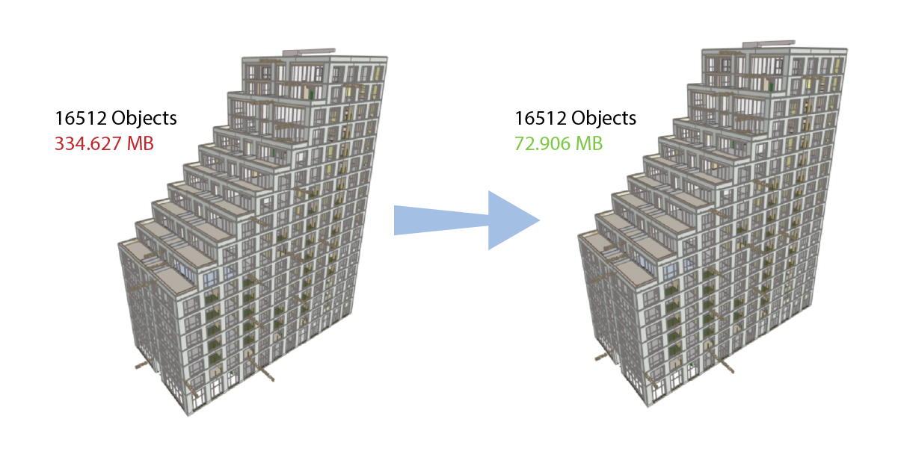
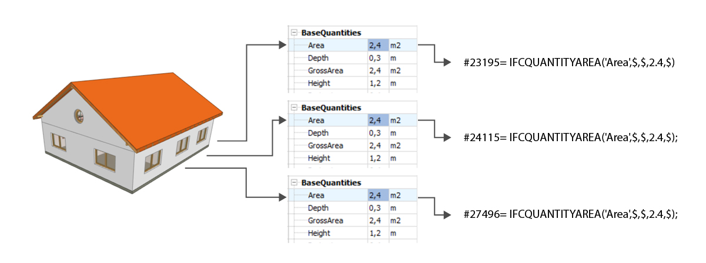
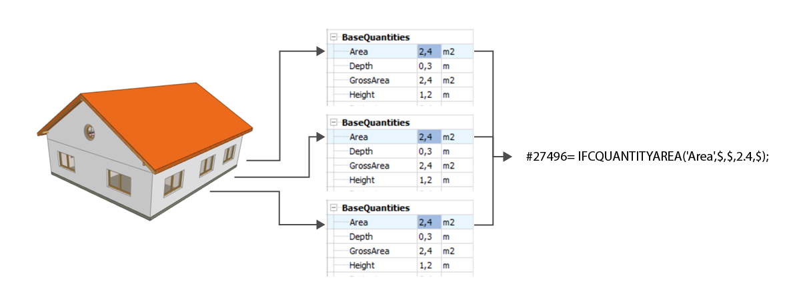

# IFCC

<!-- markdownlint-disable MD033 -->
<!-- markdownlint-disable MD034 -->

IFCC is a simple console application that compresses IFC files. The implemented method is based on the method developed by [(Sun et al., 2016)](#1) but written from scratch and extended. The general processes of the compressor are:

* Rounding of floating number values to 0.000001 meter if their precision is higher (0.000001 meter still smaller than the width of a human hair).
* Eliminating redundant data by merging objects that encode identical data. Objects such as IfcCartesianPoint, IfcDirection, and IfcPropertySingleValue. Any object that has a GUID is not touched.
* Restructuring the order in which objects are stored so that the most referenced objects are placed at the beginning of the file. This reduces the chance of large IDs being repeated often in referenced lists of other objects.
* Recalculating object IDs so that the size of both the class IDs and their references are kept at a minimum.

A visual example of the main methodology can be seen below. This model (the [FZK Haus](https://www.ifcwiki.org/index.php?title=KIT_IFC_Examples)) represents a normal IFC file. The model uses multiple IfcQuantityArea objects to encode exactly the same data but for different windows: Area = 2.4 m2. All but a single object that encodes this data can be removed without losing data. In even a simple file thousands of these items can be collapsed into a single object. For this model 9830 different objects can be eliminated.

| IFC file name  | File size (MB) | Compressed file size (MB) | Reduction |
|-|-|-|-|
| [FZK Haus](https://www.ifcwiki.org/index.php?title=KIT_IFC_Examples)  | 2.511  | 1.690  | 32.7% |
| [Office Building](https://www.ifcwiki.org/index.php?title=KIT_IFC_Examples)  | 10.679 | 2.450 | 77.1% |
| [Smiley West](https://www.ifcwiki.org/index.php?title=KIT_IFC_Examples)  | 5.967 | 2.303 | 60.4% |
| [Schependomlaan](https://github.com/jakob-beetz/DataSetSchependomlaan/tree/master) | 63.554 | 18.812 | 70.4% | 
| [Strijp S architectural - BIM bouwkundig](https://github.com/buildingsmart-community/Community-Sample-Test-Files/tree/main/IFC%202.3.0.1%20(IFC%202x3)/SDK%20-%20S1)  | 334.627 | 60.653 | 81.9% |

Compression numbers of some publicly available datasets can be seen in the table above. A reduction of 30% is already a decent score considering how simple the logic of this application is. However, based on these examples the larger the file the more compression is achieved.

Even the size of Strijp S model of 334MB drops well below the 100MB threshold for the online use of [IfcGref](https://ifcgref.bk.tudelft.nl/). This allows user to properly georeference a model without having to build a local build of IfcGref.

## How to use

The pre-compiled windows executable can be downloaded from the [releases page](https://github.com/jaspervdv/IFCC/releases). The executable work as a simple console application. It takes 2 input variables: an input path and an optional output path. If only the input path is supplied the tool will store the compressed file at the folder of the input path with the filename being the same except for the addition of "_compressed". It will show the same behavior if in the explorer an IFC file is dragged into the executable.

Current supported IFC versions:

* IFC2x3
* IFC4
* IFC4x1
* IFC4x2
* IFC4x3
* IFC4x3 ADD2

Unlike the [IfcEnvelopeExtractor](https://github.com/tudelft3d/IFC_BuildingEnvExtractor) the single executable can process all supported IFC versions.

## How to build

Recent versions of the code do not rely on any library except for the standard ones. This will make local compiling easier.

Old versions of the code are depended on [IfcOpenShell 0.7](http://ifcopenshell.org/) and [Boost](https://www.boost.org/).

## Future development

Currently the application always does a full compression. In the future options will be added to exclude and finetune certain processes.

At this moment this tool only looks at a small cluster of class objects. Potentially it would be interesting to see how much extra compression could be achieved if similar identical geometric objects could be merged to single objects with different translations.

## References

Sun, Jing, Yu-Shen Liu, Ge Gao, and Xiao-Guang Han. "IFCCompressor: A content-based compression algorithm for optimizing Industry Foundation Classes files." Automation in Construction 50 (2015): 1-15.
